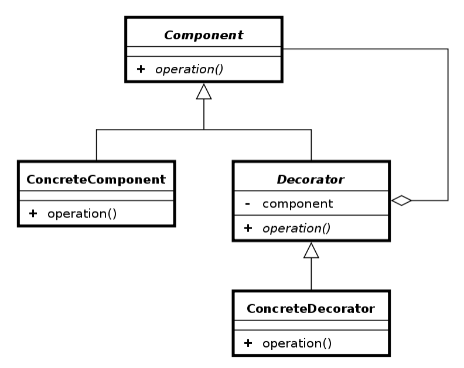

# Decorator Pattern
- Allows behavior to be added to an individual object, dynamically, without affecting behavior of other objects from same class.
# What problems can it solve?
- Responsibilities should be added to (and removed from) an object dynamically at run-time
- A flexible alternative to subclassing for extending functionality should be provided.
# What solution does it describe?
Define Decorator objects that
- implement the interface of the extended (decorated) object (Component) transparently by forwarding all requests to it
- perform additional functionality before/after forwarding a request.

