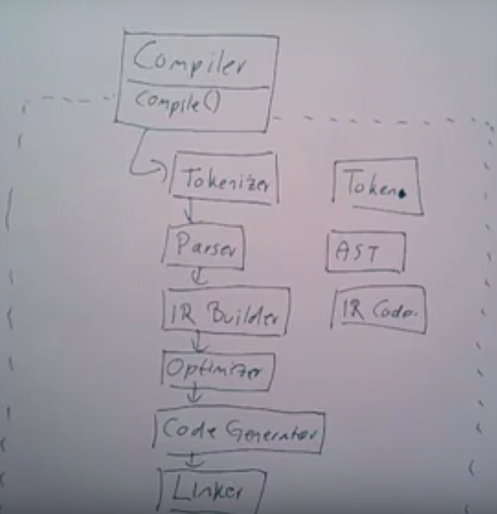

# What problems can the Facade design pattern solve?
- To make a complex subsystem easier to use, a simple interface should be provided for a set of interfaces in the subsystem.
- The dependencies on a subsystem should be minimized.

